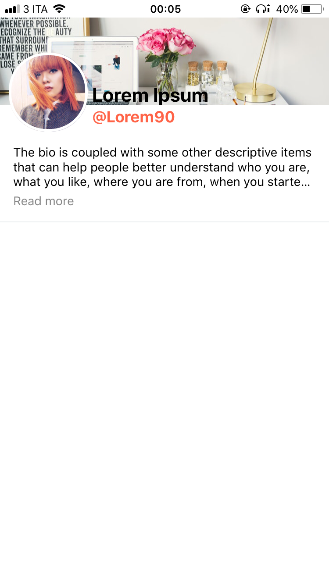
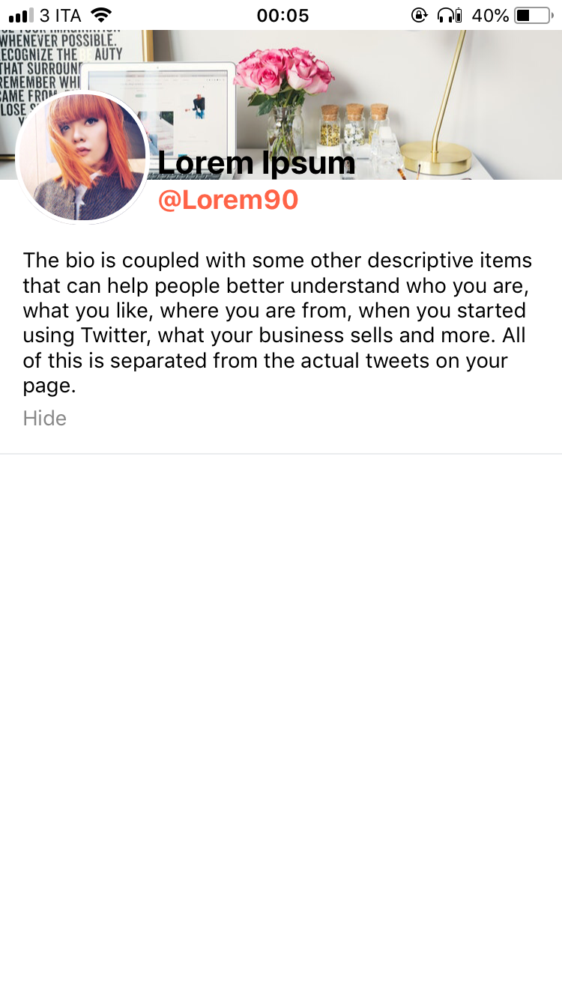

# Social header react native

A component to use on you new social app. Profile picture, cover picture, full name, username and a textbox for a short bio.





## Prerequisites

npm i react-native-read-more-text --save

# Built with 
React native

# Usage
> Make sure you have already installed these libraries
```javascript
import React from 'react';
import { StyleSheet,fontWeight, Image, backgroundColor, Text, fontFamily, fontSize, View}  from 'react-native';
import ViewMoreText from 'react-native-read-more-text';
```

## Props
Prop name | type | default
------------ | ------------- | -------------
userName | string | none 
fullName | string | none 
profilePicture| string | none 
coverPicture | string | none
bioText | string | none
userNameColor | string | blue

# Use as a component 
```javascript 
export default class App extends React.Component {

  render() {
    return (
      <View style={{flex: 1}}>
        <SocialHeader
          fullName={'Lorem Ipsum'}
          userName={'@Lorem90'}
          userNameColor={'tomato'}
          profilePicture={'https://images.unsplash.com/photo-1505330622279-bf7d7fc918f4?ixlib=rb-0.3.5&ixid=eyJhcHBfaWQiOjEyMDd9&s=334247d4893b40898bd1f74282aaada9&auto=format&fit=crop&w=750&q=80'}
          coverPicture={'https://mahasiswigoblog.files.wordpress.com/2016/06/jj.jpg?w=282&h=283'}
          bioText={"The bio is coupled with some other descriptive items that can help people better understand who you are, what you like, where you are from, when you started using Twitter, what your business sells and more. All of this is separated from the actual tweets on your page."}
        />
      </View>
    )
  }
}
```


